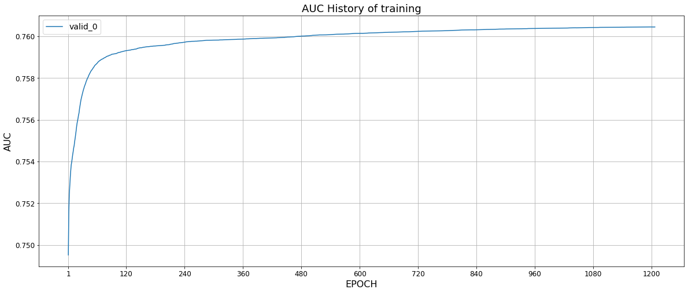
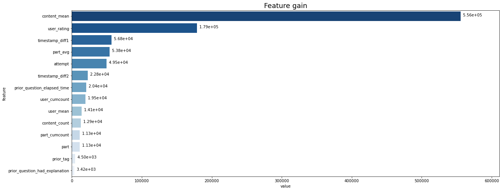
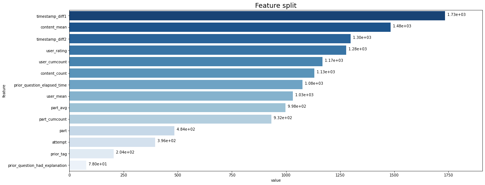

# Riiid Answer Correctness Prediction: Feature Creation + Modeling + Inference
About the Riiid AIEd Challenge 2020
Riiid Labs, an AI solutions provider delivering creative disruption to the education market, 
empowers global education players to rethink traditional ways of learning leveraging AI. 
With a strong belief in equal opportunity in education, Riiid launched an AI tutor based on 
deep-learning algorithms in 2017 that attracted more than one million South Korean students. 
This year, the company released EdNet, the world’s largest open database for AI education 
containing more than 100 million student interactions.

In this [competition](https://www.kaggle.com/c/riiid-test-answer-prediction), 
the challenge is to create algorithms for "Knowledge Tracing," the modeling of student knowledge over time. 
The goal is to accurately predict how students will perform on future interactions. 

Performance is evaluated on [area under the ROC curve](https://en.wikipedia.org/wiki/Receiver_operating_characteristic) between the predicted probability and the observed target.

# Part I: EDA + Feature Creation
All features and their short descriptions

#### Given features:

**train.csv:**:<br>
```row_id```: ID code for the row <br>
```timestamp```: the time in milliseconds between this user interaction and the first event completion from that user<br>
```user_id```: ID code for the user<br>
```content_id```: ID code for the user interaction<br>
```content_type_id```: 0 if the event was a question, 1 if the event was the lecture<br>
```task_container_id```: ID code for the batch of questions or lectures <br>
```user_answer```: the user's answer to the question, if any. Read -1 as null, for lectures<br>
```answered_correctly```: if the user responded correctly. Read -1 as null, for lectures<br>
```prior_question_elapsed_time```: The average time in milliseconds it took a user to answer each question in the previous question bundle<br>
```prior_question_had_explanation```: Whether or not the user saw an explanation and the correct response(s) after answering the previous question bundle<br>
**questions_df.csv:**<br>
```question_id```: foreign key for the train/test content_id column, when the content type is question (0)<br>
```bundle_id```: code for which questions are served together<br>
```correct_answer```: the answer to the question. Can be compared with the train user_answer column to check if the user was right<br>
```part```: the relevant section of the TOEIC test<br>
```tags```: one or more detailed tag codes for the question. The meaning of the tags will not be provided, but these codes are sufficient for clustering the questions together<br>
**lectures.csv:**<br>
```lecture_id```: foreign key for the train/test content_id column, when the content type is lecture (1)<br>
```part```: top level category code for the lecture<br>
```tag```: one tag codes for the lecture. The meaning of the tags will not be provided, but these codes are sufficient for clustering the lectures together<br>
```type_of```: brief description of the core purpose of the lecture (string - so this data needs to be treated a bit different)

#### Derived Features:

**User features:**<br>
```mean_user_accuracy```: expanding mean user accuracy <br>
```mean_accuracy_diff```: expanding mean of the difference between the mean user accuracy and mean content accuracy<br>
```mean_user_content_accuracy```: expanding mean of the mean content accuracy of questions a user answered<br>
```answered_correctly_user```: amount of questions a user answered correctly<br>
```answered_user```: amount of questions a user answered<br>
**Content features:**<br>
```mean_content_accuracy```: mean content accuracy given retry and prior_question_had_explanation (explained later)<br>
```content_count```: amount of times a question is asked<br>
**Part features:**<br>
```part```: part the question belongs to, categorical feature<br>
```mean_user_part_accuracy```: expanding mean accuracy for a user for the part the question belongs to<br>
```answered_part_user```: amount of questions a user answered in the part the question belongs to<br>
**Tag features:**<br>
```tag_2```: second tag of the question, categorical feature, -1 if question has no second part<br>
**User content features:**<br>
```hmean_user_content_accuracy```: harmonic mean of the mean_user_accuracy and mean_content_accuracy, based on this discussion<br>
**Last interaction elapsed time:**<br>
```last_interaction_elapsed_time_l1```: timestamp difference with last interaction<br>
```last_interaction_elapsed_time_l2```: timestamp difference with two interactions earlier<br>
```last_interaction_elapsed_time_l3```: timestamp difference with three interactions earlier<br>
**Other:**<br>
```attempt```: amount of times a user has attempted the question, based on this discussion<br>
```lectures_seen```: amount of lectures a user has seen

# Part II: Modeling
## Results

* AUC History of training


* Feature importance



# Part III: Inference

* Model performance on test dataset:

| Private Score  | Public Score |
| -------------- | ------------ |
| 0.794          | 0.793        |